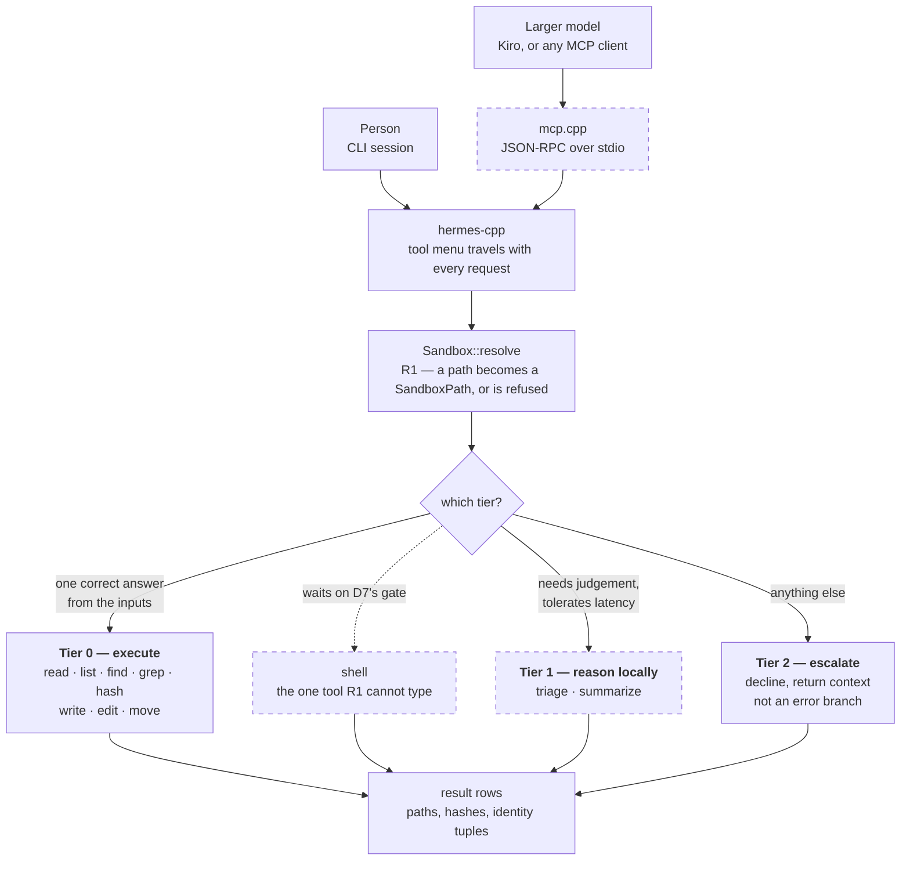
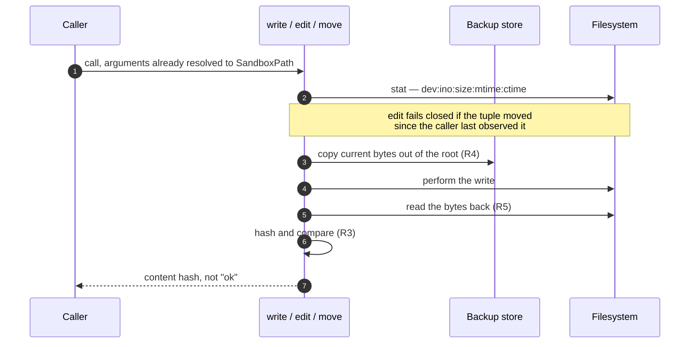
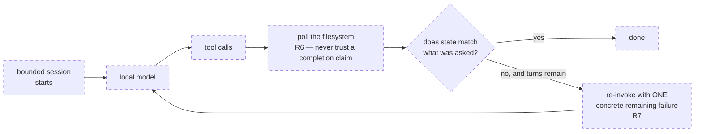

# Flow — how a request moves through Hermes-Cpp

Three diagrams: the request path, what one mutating call actually does, and the supervisor turn.

**This document defines nothing.** Every box names the document that owns it, and the prose here
does not restate a claim from those documents — it points at them. If a diagram and its source
disagree, the source is right and the diagram is a bug. That constraint is deliberate: a second
place stating the architecture is a second place for it to drift, which is the failure
[tool.h](./src/hermes/core/tool.h) exists to make unrepresentable elsewhere.

**Dashed = not built yet.** Status per [README](./README.md) as of 2026-08-16 — the sandbox, all
eight Tier 0 tools with per-call verification, the staleness guard and the backup store are
merged and tested; the loop that drives the local model and the MCP server are
[ROUTING.md](./ROUTING.md) §12 steps 4–5, the next work.

---

## 1. The request path

Two front doors ([D7](./DECISIONS.md)), one core. The labels on the branches are
[ROUTING.md](./ROUTING.md) §3's deciding rule, verbatim in substance: one correct answer
computable from the inputs goes to Tier 0; choosing among defensible answers goes to Tier 1 or
escalates.

Tier 2 is a first-class path, not a failure. A decline that returns *"I could not answer this,
but here are the 4 relevant files out of 200"* is a smaller problem handed back, which is Tier 1
doing real work even when it declines.

---

## 2. What one mutating call does

`write`, `edit` and `move` are the tools that can destroy something, so they are the ones
carrying [REQUIREMENTS.md](./REQUIREMENTS.md)'s R3, R4 and R5. All of this is built.

The backup store lives **outside** the sandbox root, so the model cannot reach what it
overwrote. And the return value is a hash rather than a success flag, because *"the file still
exists"* once passed while the content had been destroyed — that lesson is load-bearing.

---

## 3. The supervisor turn

This is the product, and it is the half not yet built. The arithmetic it rests on — a task
succeeding ~67% per attempt approaching ~96% under verified retries — is a claim computed from
measured instability, and [bench/delta](./bench/delta/DESIGN.md) exists to test it rather than
assume it.

The reason R6 polls rather than reads the model's answer: across the recorded runs, a model
replying `DONE` on an untouched tree is a thing that actually happened, repeatedly. A harness
that scored the reply would have called those runs successes.

---

## Where each piece is defined

| In the diagrams | Owned by |
|---|---|
| the three tiers, the deciding rule, the eight tools | [ROUTING.md](./ROUTING.md) §2–§4 |
| `shell` as a special case, and its gate | [ROUTING.md](./ROUTING.md) §4, §8 |
| two front doors, local inference only | [DECISIONS.md](./DECISIONS.md) D7 |
| `SandboxPath`, POSIX-order resolution | [DECISIONS.md](./DECISIONS.md) D6 |
| R3 hash, R4 backup, R5 read-back, R6 poll, R7 re-invoke | [REQUIREMENTS.md](./REQUIREMENTS.md) |
| the identity tuple and the staleness guard | [ROUTING.md](./ROUTING.md) §4 |
| what is built and what is not | [ROUTING.md](./ROUTING.md) §12 |
