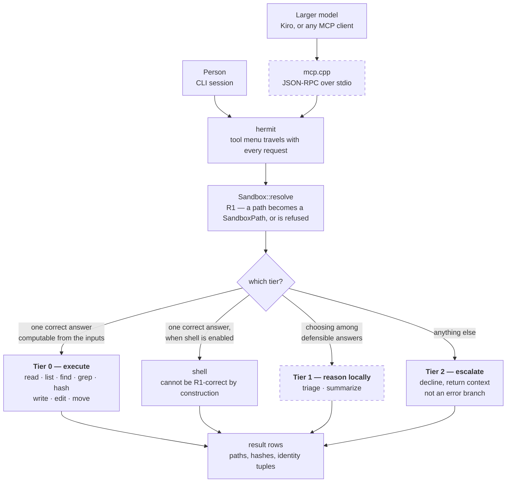
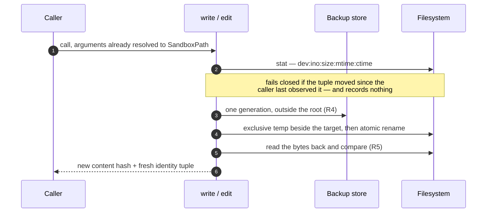
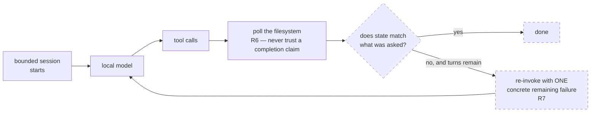

# Flow — how a request moves through Hermit

Three diagrams: the request path, what one mutating call actually does, and the supervisor turn.

**This document defines nothing.** Every box names the document that owns it, and the prose here
does not restate a claim from those documents — it points at them. If a diagram and its source
disagree, the source is right and the diagram is a bug. That constraint is deliberate: a second
place stating the architecture is a second place for it to drift, which is the failure
[tool.h](./src/hermit/core/tool.h) exists to make unrepresentable elsewhere.

**Dashed = not built yet.** Status as of 2026-08-25 — the sandbox, all eight Tier 0 tools with
per-call verification, the staleness guard, the backup store, the agent loop that drives the
local model, **and `shell`** (registered ninth, gated by an explicit config flag and a live
confinement probe; see [ROUTING.md](./ROUTING.md) §12 step 3) are merged and tested. What is
left dashed is the MCP server ([ROUTING.md](./ROUTING.md) §12 step 6) and Tier 1, and — in
diagram 3 — the verify-and-re-invoke ring that makes the loop a supervisor.

---

## 1. The request path

Two front doors ([D7](./DECISIONS.md)), one core. The labels on the branches are
[ROUTING.md](./ROUTING.md) §3's deciding rule, verbatim in substance: one correct answer
computable from the inputs goes to Tier 0; choosing among defensible answers goes to Tier 1 or
escalates.

Tier 2 is a first-class path, not a failure. A decline that returns *"I could not answer this,
but here are the 4 relevant files out of 200"* is a smaller problem handed back, which is Tier 1
doing real work even when it declines.

---

## 2. What one overwriting call does

The path below is `write` and `edit` **replacing existing bytes** — the only case that carries
all of R3, R4 and R5 at once. All of it is built. The two neighbouring cases diverge, and the
divergences are the interesting part; they are listed under the diagram.

**A create takes no backup generation.** It publishes by `link()`-no-replace, so a file that
appeared after the check is preserved and the call is rejected. Nothing is destroyed, so there
is nothing to preserve.

**`move` does not appear above, and that is deliberate.** It is ungated by observed state, takes
no backup generation, and verifies by hash at *both ends* (R3) rather than reading back. It can
do that because `renameat2(RENAME_NOREPLACE)` means it structurally cannot replace a
destination — so content is preserved byte-for-byte, only the name is at risk, and undo is
moving it back. Gating it would force a full-body read just to rename.

Two properties hold across all of them. The backup store lives **outside** the sandbox root, so
the model can never list, read, edit or move its own undo data. And every successful mutation
returns a content hash and a fresh identity tuple rather than a success flag — because *"the
file still exists"* once passed while the content had been destroyed, and that lesson is
load-bearing.

---

## 3. The supervisor turn

This is the product, and **it is now half built rather than not built.** The left side of the ring
runs: `AgentLoop` in `src/hermit/supervisor/loop.cpp` starts a bounded session, drives the model,
dispatches its calls and feeds the results back, all of it bounded by turn count and wall clock
(R8). Verified end to end against a live local model on 2026-08-17.

**`POLL` now runs too, as of 2026-08-17.** The tree is snapshotted before the run and after
every turn, and the hash-verified changeset owes nothing to the reply ([D13](./DECISIONS.md)).
So a model announcing success over an untouched tree is contradicted by evidence rather than
merely doubted.

**What is still dashed is the decision and everything after it.** Answering *"does state match
what was asked"* needs a post-condition, and a free-text instruction does not carry one — so
nothing yet compares the changeset to an intent, and nothing re-invokes with one concrete
remaining failure. `Q`, `RE` and `DONE` stay dashed, `DONE` included, because a *verified*
completion is precisely what does not exist: `StopReason::Answered` still means "the model
stopped asking" and not "the work is done".

The arithmetic it rests on — a task succeeding ~67% per attempt approaching ~96% under verified
retries — is a claim computed from measured instability, not a measured outcome, and
[bench/delta](./bench/delta/DESIGN.md) exists to test it rather than assume it.

The reason R6 polls rather than reads the model's answer: across the recorded runs, a model
replying `DONE` on an untouched tree is a thing that actually happened, repeatedly. A harness
that scored the reply would have called those runs successes.

Building the loop produced a fresh instance of the same thing, and a sharper one — the model was
not even lying about the filesystem, it was misreading data it had just been handed. That run is
recorded where it is owned, in [ROADMAP.md](./ROADMAP.md)'s Phase 3 entry; repeating it here would
make this the second place it can drift from, which the preamble above forbids.

---

## Where each piece is defined

| In the diagrams | Owned by |
|---|---|
| the three tiers, the deciding rule, the eight tools | [ROUTING.md](./ROUTING.md) §2–§4 |
| `shell` as a special case, and its gate | [ROUTING.md](./ROUTING.md) §4, §8 |
| two front doors, local inference only | [DECISIONS.md](./DECISIONS.md) D7 |
| `SandboxPath`, POSIX-order resolution | [DECISIONS.md](./DECISIONS.md) D6 |
| R3 hash, R4 backup, R5 read-back, R6 poll, R7 re-invoke | [REQUIREMENTS.md](./REQUIREMENTS.md) |
| the identity tuple and the staleness guard | [ROUTING.md](./ROUTING.md) §4 |
| what is built and what is not | [ROUTING.md](./ROUTING.md) §12 |
