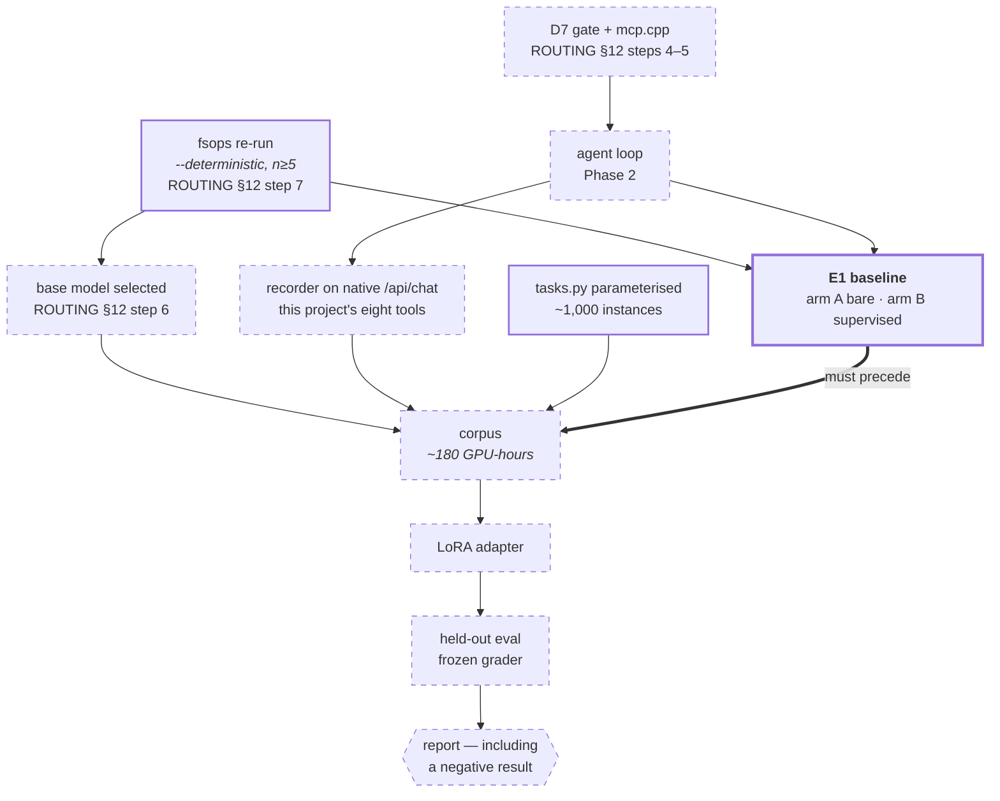

# bench/distill — training a worker model, argued before it is trained

Design settled 2026-08-16, deliberately **before any corpus exists**, in the same discipline
[bench/delta](../delta/DESIGN.md) applied to measurement: the rubric, the prerequisites and the
overturn conditions are recorded first. The evidence base already produced one retracted
leaderboard and one headline delta that sat inside the noise floor. A training run is more
expensive than either and easier to talk yourself into.

**Status: design only, and gated — not merely blocked.** Every prerequisite in §3 is unmet, and
§1 is a question this document does not answer. Nothing here schedules work.

**What this would measure in one line:** whether a LoRA fine-tune of the selected local model
raises its per-attempt success rate on [bench/fsops](../fsops/) tasks beyond the measured noise
floor — and whether that gain survives once the supervisor is doing its job.

---

## 1. The question that comes first, and is not a training question

[REQUIREMENTS.md](../../REQUIREMENTS.md) R7 rests on an arithmetic claim: a task succeeding ~67%
per attempt, retried three times with state checks between, approaches ~96%. R7's own corollary
is blunter:

> If these models were consistent, an external supervisor would be pointless.

A worker fine-tune moves the number that claim is built on. That is not fatal — a base lifted
from 67% to 80% still retries to ~99%, so the product gets *better*, not redundant. The problem
is narrower and more practical:

**A fine-tune moves E1's arm A and arm B together.** [bench/delta](../delta/DESIGN.md) exists to
measure the supervision delta against a good-faith bare baseline. Fine-tune the model first and
that baseline moves, the delta shrinks, and the headline becomes "supervision takes 80% to 99%"
— a better product described by a smaller number, with no way to recover the original claim.

**And the corpus would be drawn from supervised runs**, so the student partly learns what the
supervisor already taught it. Any measured gain is then confounded with the layer being measured.

**Consequence, and it is the whole reason this document is gated:** E1 must be collected *before*
any adapter exists. Not "should" — after, the measurement is unrecoverable.

---

## 2. The standing prior

The one matched observation in the evidence base points the wrong way.
[SWEEP2](../fsops/SWEEP2.md) §3 ran `hermes3:8b` against `llama3.1:8b` — same base, same 8.0B,
same Q8_0 — and the tool-calling fine-tune scored **3/36 against its base's 10/36**.

[NEXT-RUN.md](../fsops/NEXT-RUN.md) states the caveat more harshly than SWEEP2 does: *suggestive
but inside the noise floor*. It is not evidence that fine-tuning fails. It is evidence that a
serious lab's agentic fine-tune, on this workload, was not measurably an improvement — and that
re-running it is worth more than assuming either direction.

---

## 3. Prerequisites, all currently unmet

| # | Gate | Why it blocks | Cleared by |
|---|---|---|---|
| 1 | A base model is chosen | Adapters do not transfer across bases; training before selection trains a fork of a model that may be dropped | ROUTING §12 step 7 → step 6 |
| 2 | The recorder speaks this project's vocabulary | `proxy.py` records **upstream Hermes Agent** over `/v1/chat/completions` — tools `write_file`/`terminal`/`read_file`, and a `read_file` that decorates content with `N\|` prefixes. Hermes-Cpp uses native `/api/chat` and eight different tools. A corpus recorded today teaches tools that will never exist and a rendering [ROUTING §5](../../ROUTING.md) bans | ROUTING §12 steps 4–5, plus the agent loop |
| 3 | A task generator exists | Twelve task shapes is one to two orders of magnitude short of a LoRA corpus | new work, ~1 day |
| 4 | The grader is frozen | delta's guardrail 5; the tournament's rubric was reachable from the spec alone | before any sampling |
| 5 | E1 is collected | §1. Unrecoverable if skipped | ROUTING §12 step 7 + steps 4–5 |

**Gate 2 is the one that surprises people.** The recorder works. It records the wrong system.

### The order, drawn

The single edge that matters is the thick one: E1 must be collected before a corpus exists, for
the reason in §1. Everything dashed is unbuilt today.

Read it as a dependency graph, not a schedule. Only `fsops re-run` is startable today, and
`tasks.py parameterised` needs no gate but also buys nothing until the rest clears.

---

## 4. What the corpus would cost

Stated because nobody estimates this before agreeing to it. Figures are arithmetic from measured
medians, not measurements — the same standing [ROUTING.md](../../ROUTING.md)'s note on numbers
carries.

| quantity | value | source |
|---|---|---|
| task shapes today | 12 | [tasks.py](../fsops/tasks.py) |
| instances needed | ~1,000 | below the floor where curation reliably beats random |
| samples per instance | 10 | rejection sampling at a ~75% pass rate |
| runs | 10,000 | product of the two |
| median run | 64.6s | SWEEP2, qwen3.5:9b |
| **GPU time** | **~180 hours** | ~7.5 days continuous |

Two consequences. **The parameterizer is not optional** — twelve tasks at k=10 yields roughly 90
verified trajectories, which trains nothing. And **180 GPU-hours is the floor**, before failed
runs, before the held-out split, before a second pass against a different base.

---

## 5. Guardrails, pre-registered

1. **The held-out set never enters the pipeline.** Drawn from the generator, then quarantined
   before sampling. Evaluating on the training distribution inflates every number.
2. **Keep the reasoning traces.** Distilling on verified *outcomes* while discarding traces is a
   documented failure — answer-only distillation collapses where trace distillation succeeds. If
   the goal is removing the latency, remove the traces *at the end* by curriculum, not at the
   start by filtering.
3. **Stratify by difficulty.** Keeping only passes selects for tasks the model could already do;
   the hard tasks produce no passing sample and vanish. Spend extra samples where the pass rate
   is low, and report the per-task pass rate of the corpus itself.
4. **Baseline before adapter.** §1. Not negotiable.
5. **Noise floor first.** No gain smaller than the measured floor is a finding. The floor is
   ~3 runs in 36 on the current evidence and must be re-measured under `--deterministic`.
6. **Timeouts are failures**, never dropped — R8's rule, and the lenient-denominator error the
   published tables already contain.
7. **Publish the losses.** Tasks where the adapter is worse go in the report with the wins.
8. **If preference pairs are used, anchor them.** A verified pass and a verified fail on the same
   prompt are near-identical by construction, which is exactly where plain DPO reduces the
   likelihood of the preferred response. An NLL term on the chosen sequence is required, not
   optional.
9. **Pin everything in the report**: base tag, adapter hash, dataset hash, sampling config,
   Ollama version, Hermes-Cpp commit. A number nobody can reproduce is a rumor.

---

## 6. What would overturn the thesis

Recorded now, so the result cannot be argued into the conclusion later.

- **E1 shows supervision already closes the gap.** If verified retries deliver R7's arithmetic,
  the headroom a worker fine-tune competes for is small, and the effort belongs elsewhere.
- **D5's renderer removes most of the failure mass.** The largest measurable gap in the suite is
  tool-call *formatting* — a 3B emitting a call as prose, a list where a string belongs.
  Constrained decoding removes that class at decode time, for free, once
  [tool.h](../../src/hermes/core/tool.h)'s schema actually renders. Measure after that lands, not
  before.
- **The corpus cannot reach ~1,000 instances** without synthesizing tasks so far from real usage
  that they measure the generator instead of the model.
- **The gain does not survive the held-out split.** Then it was memorization, and the run is
  reported as a negative result.

---

## 7. What this is not

Not a plan to ship weights. The trained artifact would be a **dependency, not a deliverable** —
it lives in Ollama's model store, referenced by tag, exactly as `qwen3.5:9b` is today, and it is
disposable on the next base model. What the repository would hold is the tag pin, the recipe, and
the eval that gates it.

Not in [SCOPE.md](../../SCOPE.md)'s product, which is R3–R7 plus a thin agent loop. Adding a
training program is scope growth, and this document exists so that growth is decided rather than
drifted into.

Not a claim that fine-tuning helps. On the only matched evidence available, it did not.
